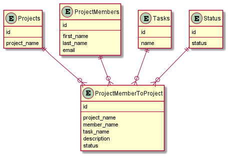
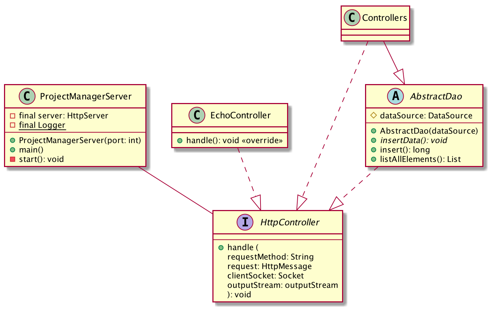
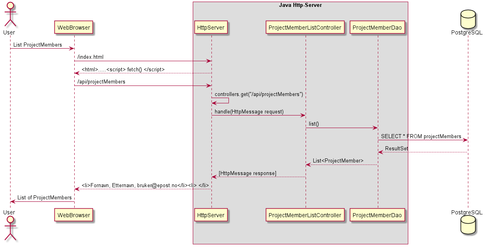

# PGR203 EKSAMEN

#### Gruppemedlemmer:
Pål Anders Byenstuen, Eirik Lundanes og Vibeke Opgård.

-----------------------------------------------------------

## Beskrivelse av prosjekt

Til eksamen i PGR203 Avansert Java har vi laget en webapplikasjon som kan lagre og liste ut prosjektmedlemmer, og opprette prosjekter og prosjektdeltakere fra databasen. Det er mulig å legge til et "member" med fornavn, etternavn og e-postadresse og se den på websiden. Oppgaven er utviklet med test-drevet parprogrammering.

Programmet kan brukes ved å besøke localhost:8080 i nettleseren. Her kan du velge member, project, task, og endre status på oppgaver.

### Arbeidsform
Arbeidet med innlevering 1-3 foregikk i stor grad som testdrevet par(trio)-programmering over Discord, noe som fungerte veldig bra. Eksamensoppgaven krevde derimot at vi måtte utforske temaet enda dypere, og vi begynte derfor å jobbe mer fysisk sammen. Istedenfor at vi fordelte issues mellom oss, så fokuserte alle tre på ett og ett issue, i hovedsak på samme maskin. Derfor fremkommer commitloggen ganske misvisende når det kommer til deltakelse i prosjektet. [Projects-tabben](https://github.com/kristiania/pgr203eksamen-eirik124/projects/1) er en bedre representasjon av arbeidsfordelingen enn commitloggen.

Link til par(trio)-programmeringsvideo:
[Parprogrammerings-video](https://youtu.be/t6ZQ8bYZdlo)

Link til pull request som viser hvordan vi jobbet sammen over Discord på innlevering 2:
[pgr203innlevering2-eirik124/pull/1](https://github.com/kristiania/pgr203innlevering2-eirik124/pull/1)


## GitHub Actions
Link til Github Actions:
[Github Actions](https://github.com/kristiania/pgr203eksamen-eirik124/actions)

-----------------------------
## UML-modeller


### Database-struktur



### Server-struktur



Struktur som viser hva som skjer i programmet når man henter ut eksempelvis prosjektmedlemmer:


-----------------------------
## Hvordan det bygges
Baseres på programmet IntelliJ fremgangsmåte kan variere fra program til program

Man bygger .jar-filen ved å velge View -> Tool Windows -> Maven. Da åpnes det et Maven-vindu under ```Lifecycle```. Man velger så ```Package``` og deretter kjører den pakking og bygging på et par sekunder.

-----------------------------
## Hvordan det kjøres

Vær sikker på at du har en PostgreSQL-database satt opp som er mulig å koble seg til. Deretter lager du en ```pgr203.properties``` som skal inneholde følgende
```
dataSource.url=jdbc:postgresql://server:port/databasename   //urlen til serveren
dataSource.username=username   //brukernavnet som har access til SQL serveren
dataSource.password=passord //her setter du et passord  som er sikkert som ingen vet
```

Man kjører serveren med .jar-filen ved å kjøre ```java -jar target/http-server.jar``` eller det man renamer filen til etter build. 
Default port er 8080. Nettsiden kjøres default på localhost:8080 eller den porten som blir satt av bruker.

## Eksamen sjekkliste

### Sjekkliste for innlevering
- [ ] Dere har lastet opp en ZIP-fil med navn basert på navnet på deres Github repository
- [X] Koden er sjekket inn på github.com/kristiania-repository
- [ ] Dere har committed kode med begge prosjektdeltagernes GitHub konto (alternativt: README beskriver arbeidsform)
README.md

### Readme.md

- [X] README.md inneholder en korrekt link til Github Actions
- [X] README.md beskriver prosjektets funksjonalitet, hvordan man bygger det og hvordan man kjører det
- [ ] README.md beskriver eventuell ekstra leveranse utover minimum
- [ ] README.md inneholder et diagram som viser datamodellen
Koden

### Koden

- [X] mvn package bygger en executable jar-fil
- [X] Koden inneholder et godt sett med tester
- [X] java -jar target/...jar (etter mvn package ) lar bruker legge til og liste ut data fra databasen via webgrensesnitt
- [X] Programmet leser dataSource.url , dataSource.username og dataSource.password fra pgr203.properties for å connecte til databasen
- [X] Programmet bruker Flywaydb for å sette opp databaseskjema
- [X] Server skriver nyttige loggmeldinger, inkludert informasjon om hvilken URL den kjører på ved oppstart
Funksjonalitet

### Funksjonalitet

- [X] Programmet kan liste prosjektdeltagere fra databasen
- [X] Programmet lar bruker opprette nye prosjektdeltagere i databasen
- [X] Programmet kan opprette og liste prosjektoppgaver fra databasen
- [X] Programmet lar bruker tildele prosjektdeltagere til oppgaver
- [ ] Flere prosjektdeltagere kan tildeles til samme oppgave
- [X] Programmet lar bruker endre status på en oppgave

### Ekstra poeng sjekklist
- [X] Håndtering av request target "/"
- [X] Avansert datamodell (mer enn 3 tabeller)
- [X] Avansert funksjonalitet (redigering av prosjektmedlemmer, statuskategorier, prosjekter)
- [ ] Implementasjon av cookies for å konstruere sesjoner: https://tools.ietf.org/html/rfc6265#section-3
- [X] UML diagram som dokumenterer datamodell og/eller arkitektur (presentert i README.md)
- [ ] Rammeverk rundt Http-håndtering (en god HttpMessage class med HttpRequest og HttpResponse subtyper) som gjenspeiler RFC7230
- [X] God bruk av DAO-pattern
- [X] God bruk av Controller-pattern
- [X] Korrekt håndtering av norske tegn i HTTP
- [X] Link til video med god demonstrasjon av ping-pong programmering
- [X] Automatisk rapportering av testdekning i Github Actions
- [X] Implementasjon av Chunked Transfer Encoding: https://tools.ietf.org/html/rfc7230#section-4.1
- [ ] Annet
